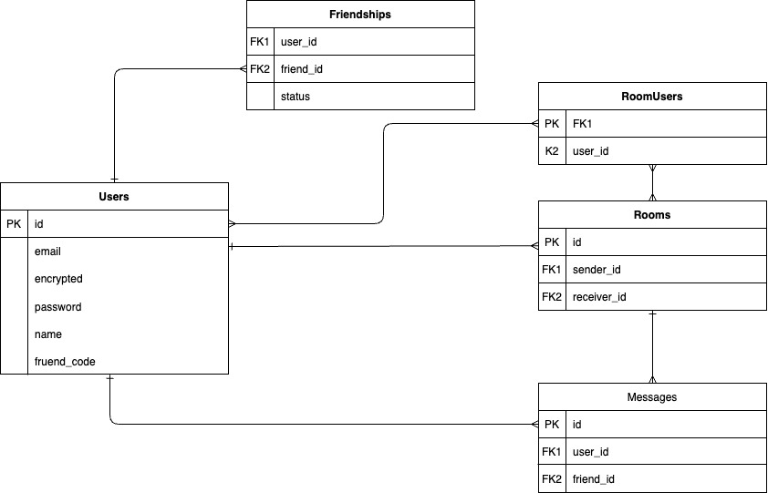

# SimpleChat

## 概要
**SimpleChat** は、友人と1対1のチャットができるシンプルなアプリケーションです。
チャット機能やユーザー検索機能を実装し、気軽にコミュニケーションを取れる設計となっています。

## 作成の目的
ポートフォリオ用に制作しました。

## 使用技術
- **フロントエンド**: HTML / SCSS / Bootstrap / JavaScript（現在学習中）
- **バックエンド**: Ruby / Ruby on Rails
- **データベース**: SQLite3
- **その他ライブラリ等**:
  - Devise（ユーザー認証）
  - jQuery-Rails（非同期処理）
  - Font Awesome（アイコン）
  - Bootstrap（UI）
  - Sass-Rails（スタイル管理）

## ER図

---

## インフラ構成図

## 主な機能
- ユーザー登録・ログイン機能（Deviseを使用）
- ランダムに割り振られたIDを使ったユーザー検索機能
- 1対1のチャット機能（Ajaxによる非同期通信）
- 選択中の友人の強調表示＆一覧の上部に固定
- チャットの最終更新から6日（144時間）後に自動削除される機能

## 工夫したポイント
- フレンド一覧で、選択中のユーザーを上部に固定表示
- Ajaxによるスムーズなメッセージ送受信体験
- SCSSとBootstrapを組み合わせ、シンプルなデザインを意識
- 無料サーバーの容量制限を考慮し、自動削除機能を導入

---